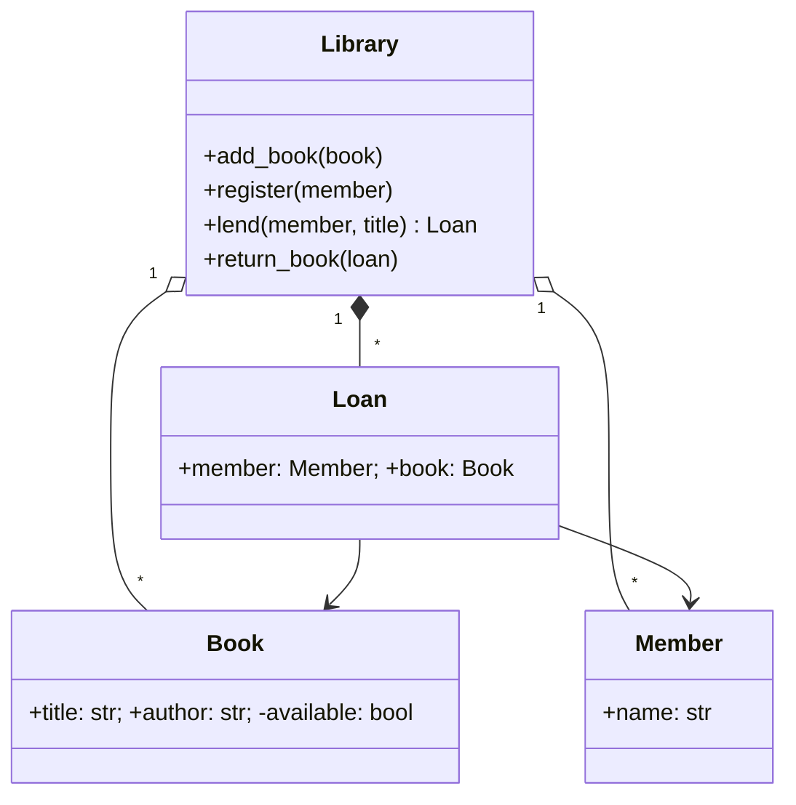

# Practice Tasks for Chapter 11

**Task type:** read and build UML diagrams; refactor "bad"
code according to the SOLID principles.

Requirements for **every** code task:
1. show that the behavior was preserved;
2. demonstrate **extension without modifying** the existing code (where O/D is concerned);
3. tests on fakes/stand-in objects (where D is concerned);
4. 3 checks using `assert`.

Tasks **11.2** and **11.3** are about diagrams; the answers are in the file
`розв'язки-діаграми.md`, not in code.

---

### Task 11.1 (diagram → code)
Implement the following class diagram:


`lend` raises an error if the book does not exist, has already been lent out,
or the reader is not registered. The loan log (`Loan`) belongs to the library.

### Task 11.2 (code → diagram)
From the code (Python), draw a class diagram in Mermaid with member
visibility, relationship types, and multiplicity:

```python
class Product:
    def __init__(self, name, price): self.name, self._price = name, price

class OrderLine:
    def __init__(self, product: Product, qty: int): ...
    def cost(self): ...

class Order:
    def __init__(self, customer):
        self.customer = customer
        self._lines = []                 # creates OrderLine itself
    def add(self, product, qty): ...
    def pay(self, payment: "Payment"): ...

class Customer:
    def __init__(self, name): self.name = name; self.orders = []

class Payment(ABC):
    @abstractmethod
    def charge(self, amount): ...

class CardPayment(Payment): ...
class CashPayment(Payment): ...
```

### Task 11.3 (scenario → diagram)
Draw a sequence diagram for the scenario "A user
places an order": `User` → `OrderService.place(order)` →
`Repository.save(order)` → `PaymentGateway.charge(...)`;
on success — `Notifier.send(...)`, on a declined payment — `Repository.cancel`.
Use an `alt` block.

### Task 11.4 — S
A `Report` class simultaneously computes statistics (`sum`, `avg`),
formats them as text, and "saves" them to a file. Split it into
`ReportData`, `TextFormatter` (+ `CsvFormatter`), and `Saver`
(test with a `MemorySaver`).

### Task 11.5 — O
A function `price(kind, amount)` with an `if/elif` chain for client
types (`regular`, `vip`, `student`). Rewrite it using `Discount`
strategies; add an `EmployeeDiscount` **without modifying** the existing classes.

### Task 11.6 — L
`Square(Rectangle)` breaks the function
`stretch(rect)` (sets the width to 5 and the height to 4, expects an area of 20).
Rework the hierarchy (immutable `Shape` objects) so that substitution
is correct.

### Task 11.7 — I
A "fat" interface `Machine` (`print`, `scan`, `fax`).
Split it into `Printer`, `Scanner`, `FaxSender`; implement
`OldPrinter` (printing only), `MultiFunction` (everything) and a function
`run_print_job(printer)` that accepts only what it needs.

### Task 11.8 — D
`OrderService` creates a `MySqlRepository` and an `SmtpEmailer` inside itself.
Introduce the abstractions `OrderRepository` and `Notifier`; in a test
use an `InMemoryRepository` and a `FakeNotifier`.

### Task 11.9 — S + O
A "god class" `Employee`: computes salary depending on
the position (`if position == ...`), saves itself to a DB, and prints
a pay slip. Refactor: calculation strategies, a separate
repository, a separate formatter; a `Payroll` service orchestrates them.

### Task 11.10 — S + O + L + I + D
A user registration service `RegistrationService`:
checking a set of rules (`Validator`), saving (`UserRepository`),
notification (`Notifier`). Design it so that new rules
are added without changing the service, and all dependencies are abstractions.
Show a test on fakes.
