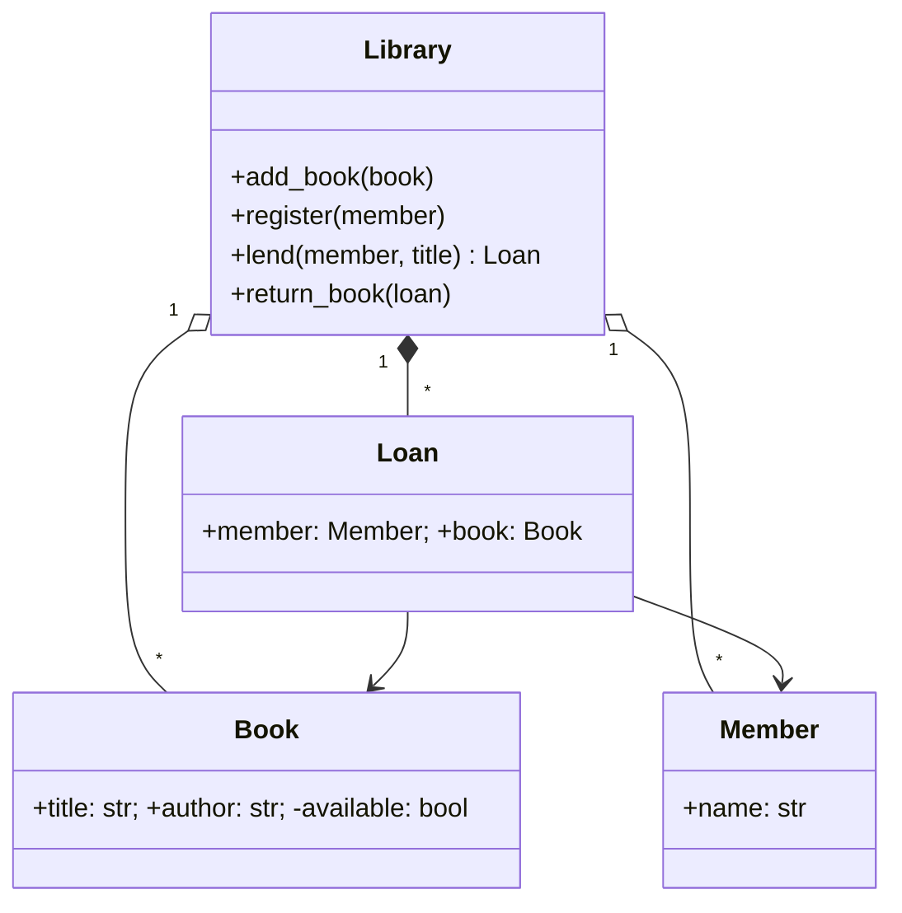

# Практичні завдання до розділу 11

**Тип завдань:** читати та будувати UML-діаграми; рефакторити «поганий»
код відповідно до принципів SOLID.

Вимоги до **кожної** задачі з кодом:
1. показати, що поведінка збереглась;
2. продемонструвати **розширення без зміни** існуючого коду (де йдеться про O/D);
3. тести на фейках/підставних об'єктах (де йдеться про D);
4. 3 перевірки через `assert`.

Задачі **11.2** та **11.3** — на діаграми; відповіді — у файлі
`розв'язки-діаграми.md`, а не в коді.

---

### Задача 11.1 (діаграма → код)
Реалізуйте за діаграмою класів:


`lend` кидає помилку, якщо книги немає, вона вже видана
або читача не зареєстровано. Журнал позик (`Loan`) належить бібліотеці.

### Задача 11.2 (код → діаграма)
За кодом (Python) намалюйте діаграму класів у Mermaid із видимістю
членів, типами зв'язків і кратністю:

```python
class Product:
    def __init__(self, name, price): self.name, self._price = name, price

class OrderLine:
    def __init__(self, product: Product, qty: int): ...
    def cost(self): ...

class Order:
    def __init__(self, customer):
        self.customer = customer
        self._lines = []                 # створює OrderLine самостійно
    def add(self, product, qty): ...
    def pay(self, payment: "Payment"): ...

class Customer:
    def __init__(self, name): self.name = name; self.orders = []

class Payment(ABC):
    @abstractmethod
    def charge(self, amount): ...

class CardPayment(Payment): ...
class CashPayment(Payment): ...
```

### Задача 11.3 (сценарій → діаграма)
Намалюйте діаграму послідовності для сценарію «Користувач
оформлює замовлення»: `User` → `OrderService.place(order)` →
`Repository.save(order)` → `PaymentGateway.charge(...)`;
при успіху — `Notifier.send(...)`, при відмові оплати — `Repository.cancel`.
Використайте блок `alt`.

### Задача 11.4 — S
Клас `Report` одночасно рахує статистику (`sum`, `avg`),
форматує її в текст та «зберігає» у файл. Розділіть на
`ReportData`, `TextFormatter` (+ `CsvFormatter`) і `Saver`
(тест — з `MemorySaver`).

### Задача 11.5 — O
Функція `price(kind, amount)` з ланцюжком `if/elif` для типів
клієнтів (`regular`, `vip`, `student`). Перепишіть через стратегії
`Discount`; додайте `EmployeeDiscount` **без змін** існуючих класів.

### Задача 11.6 — L
`Square(Rectangle)` ламає функцію
`stretch(rect)` (ставить ширину 5 і висоту 4, очікує площу 20).
Переробіть ієрархію (незмінні `Shape`-об'єкти), щоб підстановка
була коректною.

### Задача 11.7 — I
«Товстий» інтерфейс `Machine` (`print`, `scan`, `fax`).
Розділіть на `Printer`, `Scanner`, `FaxSender`; реалізуйте
`OldPrinter` (лише друк), `MultiFunction` (усе) та функцію
`run_print_job(printer)`, що приймає лише потрібне.

### Задача 11.8 — D
`OrderService` усередині створює `MySqlRepository` і `SmtpEmailer`.
Впровадьте абстракції `OrderRepository` та `Notifier`; у тесті
використайте `InMemoryRepository` та `FakeNotifier`.

### Задача 11.9 — S + O
«Божественний клас» `Employee`: рахує зарплату залежно від
посади (`if position == ...`), зберігає себе в БД і друкує
розрахунковий лист. Рефакторинг: стратегії розрахунку, окремий
репозиторій, окремий форматувальник; сервіс `Payroll` оркеструє їх.

### Задача 11.10 — S + O + L + I + D
Сервіс реєстрації користувача `RegistrationService`:
перевірка набору правил (`Validator`), збереження (`UserRepository`),
сповіщення (`Notifier`). Спроєктуйте так, щоб нові правила
додавалися без зміни сервісу, а всі залежності були абстракціями.
Покажіть тест на фейках.
