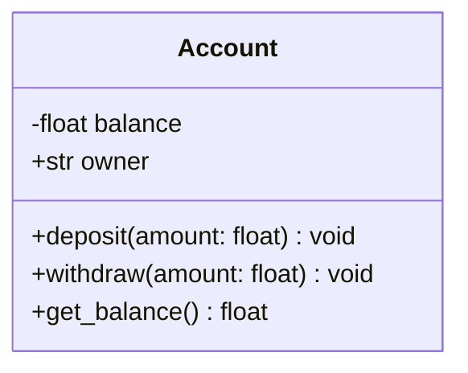
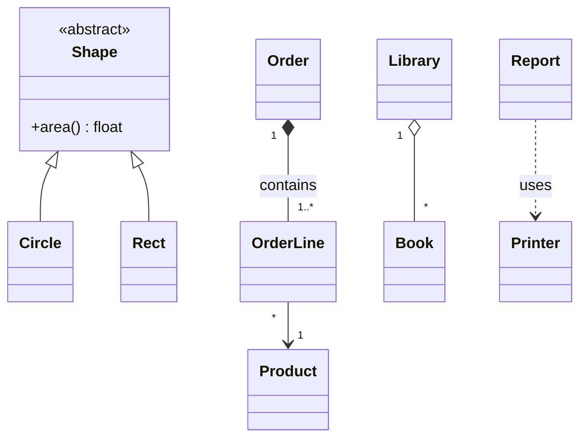
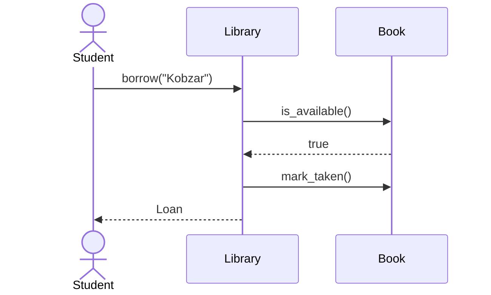

# Chapter 11. UML and the SOLID Principles

## 11.1 What Is UML

**UML** (Unified Modeling Language) is a standard graphical language for describing
software systems. For OOP, the two most useful kinds of diagrams are:

- the **class diagram** — static structure: classes and the relationships between them;
- the **sequence diagram** — dynamics: who sends messages to whom and in what order.

Diagrams can be written as text (Mermaid, PlantUML) — they render
on GitHub, in VS Code, Notion, and other editors.

## 11.2 The Class Diagram

A class is a rectangle with three sections: the **name**, the **attributes**, and the
**methods**.



Visibility: `+` public, `-` private, `#` protected, `~` package.
Static members are underlined (`$` in Mermaid), abstract ones are in italics (`*`).

### Relationships Between Classes

| Relationship | Notation (Mermaid) | Meaning | Example |
|--------------|--------------------|---------|---------|
| Inheritance (generalization) | `Animal <|-- Dog` | "is a" | `Dog` — `Animal` |
| Interface realization | `Shape <|.. Circle` | the class implements a contract | `Circle` implements `Shape` |
| Composition | `Car *-- Engine` | "has a", the part **does not exist without the whole** | `Car` — `Engine` |
| Aggregation | `Library o-- Book` | "has a", the part **exists separately** | `Library` — `Book` |
| Association | `Teacher --> Course` | "knows/uses" permanently (a field) | |
| Dependency | `Report ..> Printer` | "uses temporarily" (a parameter/local variable) | |

Multiplicity: `"1"`, `"0..1"`, `"*"`, `"1..*"`.



## 11.3 The Sequence Diagram



`->>` is a call, `-->>` is a reply. The vertical axis is time.

## 11.4 SOLID: Five Principles of Good Design

SOLID is a set of recommendations by Robert Martin that make code
**flexible, testable, and ready for change**.

### S — Single Responsibility

> A class should have **one reason to change**.

Bad — one class computes, formats, and stores:

```python
class Report:
    def calculate(self): ...
    def to_html(self): ...
    def save_to_file(self, path): ...
```

Good — three classes (`ReportData`, `HtmlFormatter`, `FileSaver`);
when the format changes, we touch only the formatter.

### O — Open/Closed

> Entities should be **open for extension, closed for modification**.

Bad — an `if/elif` on the client type that has to be edited for every new type:

```python
def discount(kind, amount):
    if kind == "regular": return 0
    elif kind == "vip":   return amount * 0.1
```

Good — strategies: a new type = **a new class**, the existing code does not change.

```python
class Discount(ABC):
    @abstractmethod
    def apply(self, amount): ...
class VipDiscount(Discount):
    def apply(self, amount): return amount * 0.1
```

### L — Liskov Substitution

> A child must be **interchangeable** with its parent without breaking the correctness of the program.

The classic: `Square(Rectangle)` violates the contract of `set_width()/set_height()`
(for a square they are linked). Signs of a violation: the child raises
`NotImplementedError`, strengthens preconditions, weakens postconditions, and the client
is forced to use `isinstance`. The cure: a different hierarchy (a shared
abstract `Shape` with immutable objects) or composition.

### I — Interface Segregation

> Clients should not depend on methods they **do not use**.

Bad — a "fat" `Machine` interface with `print/scan/fax`, which an old
printer is forced to implement with "stubs". Good — small
`Printer`, `Scanner`, `Fax`; a class implements the ones it needs.

### D — Dependency Inversion

> High-level modules should not depend on low-level
> modules. **Both should depend on abstractions.**

Bad:

```python
class OrderService:
    def __init__(self):
        self.db = MySqlDatabase()       # a hard dependency
```

Good:

```python
class OrderService:
    def __init__(self, repo: OrderRepository, notifier: Notifier):
        self.repo, self.notifier = repo, notifier     # we inject abstractions
```

In a test we pass an `InMemoryRepository` and a `FakeNotifier`.

## 11.5 How the Principles Relate

| Principle | Tool | What it gives |
|-----------|------|---------------|
| S | splitting classes | small, understandable classes |
| O | polymorphism, strategies | extension without edits |
| L | correct inheritance | safe substitution |
| I | small interfaces | fewer unnecessary dependencies |
| D | dependency injection | testability, flexibility |

> The principles are **not dogmas**. Over-engineering (an interface for every class)
> is as harmful as a "god class". Apply them when
> a **real reason for change** appears.

Also useful: **DRY** (don't repeat yourself), **KISS** (keep it simple),
**YAGNI** (don't write what is not needed now), the Law of Demeter (chapter 8).

## 11.6 Comparison with Other Languages

The principles are language-independent. Only the tools differ:

| | Python | JavaScript | C++ |
|---|--------|-----------|-----|
| Abstraction for O/D | `ABC`, `Protocol`, duck typing | duck typing | abstract classes, templates |
| Interfaces for I | `ABC` / `Protocol` | duck typing + documentation, TypeScript `interface` | classes with pure virtual methods |
| Dependency injection | constructor arguments | constructor arguments | a reference/`unique_ptr` in the constructor |

## 11.7 Self-Check Questions

1. How does composition differ from aggregation in a class diagram?
2. How does a dependency differ from an association?
3. Name the signs of a Liskov principle violation.
4. How is the O/C principle related to polymorphism?
5. Why does dependency inversion make testing easier?
