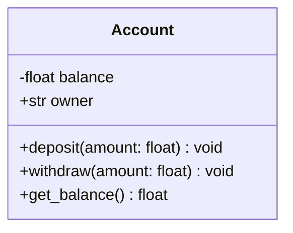
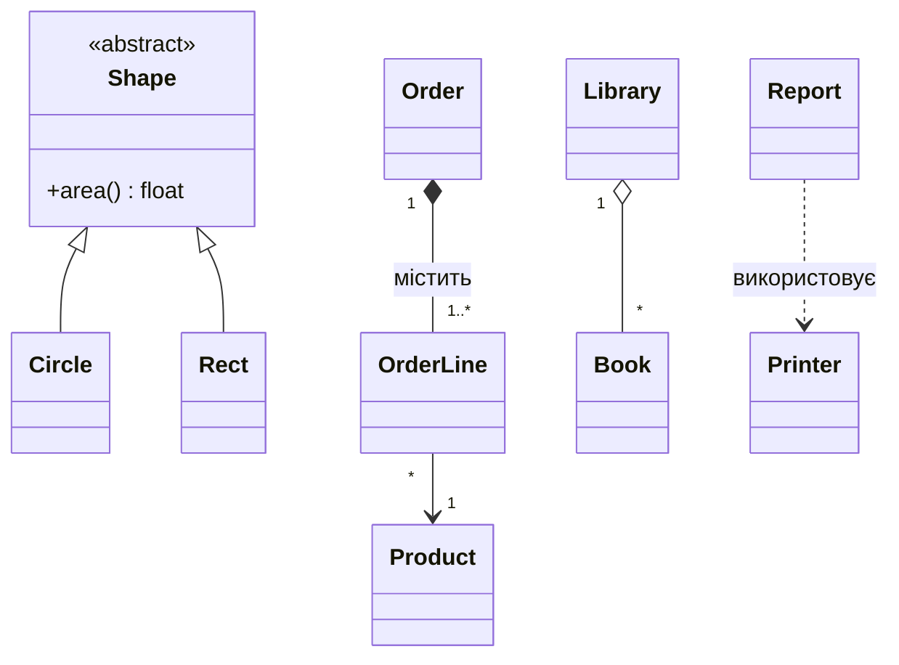
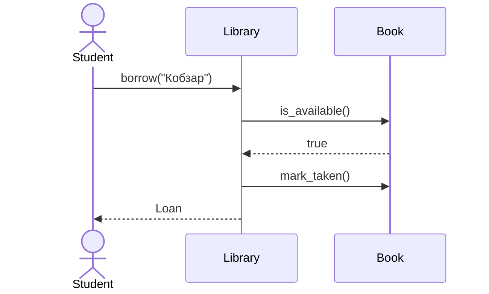

# Розділ 11. UML та принципи SOLID

## 11.1 Що таке UML

**UML** (Unified Modeling Language) — стандартна графічна мова опису
програмних систем. Для ООП найкорисніші два види діаграм:

- **діаграма класів** — статична структура: класи та зв'язки між ними;
- **діаграма послідовності** — динаміка: хто кому і в якому порядку надсилає повідомлення.

Діаграми можна писати текстом (Mermaid, PlantUML) — вони відображаються
у GitHub, VS Code, Notion та інших редакторах.

## 11.2 Діаграма класів

Клас — прямокутник із трьома секціями: **назва**, **атрибути**,
**методи**.



Видимість: `+` публічний, `-` приватний, `#` захищений, `~` пакетний.
Статичні члени підкреслюють (`$` у Mermaid), абстрактні — курсивом (`*`).

### Зв'язки між класами

| Зв'язок | Позначка (Mermaid) | Сенс | Приклад |
|---------|--------------------|------|---------|
| Успадкування (генералізація) | `Animal <|-- Dog` | «є» | `Dog` — `Animal` |
| Реалізація інтерфейсу | `Shape <|.. Circle` | клас реалізує контракт | `Circle` реалізує `Shape` |
| Композиція | `Car *-- Engine` | «має», частина **не існує без цілого** | `Car` — `Engine` |
| Агрегація | `Library o-- Book` | «має», частина **існує окремо** | `Library` — `Book` |
| Асоціація | `Teacher --> Course` | «знає/використовує» постійно (поле) | |
| Залежність | `Report ..> Printer` | «тимчасово використовує» (параметр/локальна змінна) | |

Кратність: `"1"`, `"0..1"`, `"*"`, `"1..*"`.



## 11.3 Діаграма послідовності



`->>` — виклик, `-->>` — відповідь. Вертикальна вісь — час.

## 11.4 SOLID: п'ять принципів гарного дизайну

SOLID — набір рекомендацій Роберта Мартіна, що роблять код
**гнучким, тестованим і придатним до змін**.

### S — Single Responsibility (єдина відповідальність)

> Клас повинен мати **одну причину для зміни**.

Погано — клас і рахує, і форматує, і зберігає:

```python
class Report:
    def calculate(self): ...
    def to_html(self): ...
    def save_to_file(self, path): ...
```

Добре — три класи (`ReportData`, `HtmlFormatter`, `FileSaver`);
змінюється формат — чіпаємо лише форматувальник.

### O — Open/Closed (відкритість / закритість)

> Сутності **відкриті для розширення, закриті для змін**.

Погано — `if/elif` по типу клієнта, який доводиться правити для кожного нового типу:

```python
def discount(kind, amount):
    if kind == "regular": return 0
    elif kind == "vip":   return amount * 0.1
```

Добре — стратегії: новий тип = **новий клас**, існуючий код не змінюється.

```python
class Discount(ABC):
    @abstractmethod
    def apply(self, amount): ...
class VipDiscount(Discount):
    def apply(self, amount): return amount * 0.1
```

### L — Liskov Substitution (підстановка Лісков)

> Нащадок має **бути взаємозамінним** з предком, не ламаючи коректності програми.

Класика: `Square(Rectangle)` порушує контракт `set_width()/set_height()`
(у квадрата вони пов'язані). Ознаки порушення: нащадок кидає
`NotImplementedError`, посилює передумови, послаблює післяумови, а клієнт
змушений робити `isinstance`. Лікування: інша ієрархія (спільний
абстрактний `Shape` з незмінними об'єктами) або композиція.

### I — Interface Segregation (розділення інтерфейсів)

> Клієнти не повинні залежати від методів, які вони **не використовують**.

Погано — «товстий» інтерфейс `Machine` із `print/scan/fax`, який старий
принтер змушений реалізовувати «заглушками». Добре — маленькі
`Printer`, `Scanner`, `Fax`; клас реалізує потрібні.

### D — Dependency Inversion (інверсія залежностей)

> Модулі верхнього рівня не повинні залежати від модулів нижнього
> рівня. **Обидва залежать від абстракцій.**

Погано:

```python
class OrderService:
    def __init__(self):
        self.db = MySqlDatabase()       # жорстка залежність
```

Добре:

```python
class OrderService:
    def __init__(self, repo: OrderRepository, notifier: Notifier):
        self.repo, self.notifier = repo, notifier     # впроваджуємо абстракції
```

У тесті передаємо `InMemoryRepository` і `FakeNotifier`.

## 11.5 Зв'язок принципів

| Принцип | Інструмент | Що дає |
|---------|------------|--------|
| S | розділення класів | малі, зрозумілі класи |
| O | поліморфізм, стратегії | розширення без правок |
| L | коректне успадкування | безпечна підстановка |
| I | малі інтерфейси | менше зайвих залежностей |
| D | впровадження залежностей | тестованість, гнучкість |

> Принципи — **не догми**. Над-проєктування (по інтерфейсу на кожен клас)
> шкодить так само, як і «божественний клас». Застосовуйте їх, коли
> з'являється **реальна причина зміни**.

Також корисні: **DRY** (не повторюйся), **KISS** (будь простішим),
**YAGNI** (не пиши того, що не потрібно зараз), закон Деметри (розділ 8).

## 11.6 Порівняння з іншими мовами

Принципи — мовонезалежні. Відмінності лише у засобах:

| | Python | JavaScript | C++ |
|---|--------|-----------|-----|
| Абстракція для O/D | `ABC`, `Protocol`, duck typing | duck typing | абстрактні класи, шаблони |
| Інтерфейси для I | `ABC` / `Protocol` | duck typing + документація, TypeScript `interface` | класи з чисто віртуальними методами |
| Впровадження залежностей | аргументи конструктора | аргументи конструктора | посилання/`unique_ptr` у конструкторі |

## 11.7 Питання для самоперевірки

1. Чим композиція відрізняється від агрегації на діаграмі класів?
2. Чим залежність відрізняється від асоціації?
3. Назвіть ознаки порушення принципу Лісков.
4. Як принцип O/C пов'язаний із поліморфізмом?
5. Чому інверсія залежностей полегшує тестування?
